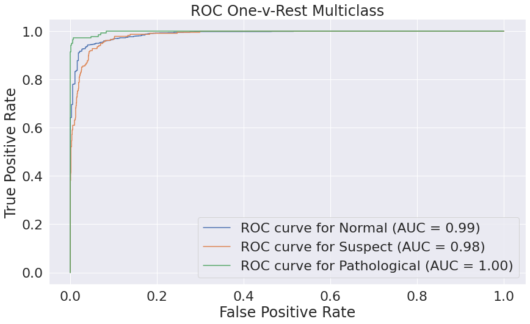

# Cardio Tocograph (CTG) Data and Fetal Health Predictions
Using Standard CTG results to more rapidly detect
latent health concerns during pregnancy.

Data used herein was obtained from
[here, via kaggle](https://www.kaggle.com/datasets/andrewmvd/fetal-health-classification)  
<sup>kaggle data set was obtained via this research - 
[Ayres de Campos et al. (2000) SisPorto 2.0 A Program for Automated Analysis of Cardiotocograms. J Matern Fetal Med 5:311-318](https://onlinelibrary.wiley.com/doi/10.1002/1520-6661(200009/10)9:5%3C311::AID-MFM12%3E3.0.CO;2-9)</sup>

## Overview
Cardiotocographs, or CTGs, measure vital data related
to fetal health. They are usually performed in the
third trimester - or slightly earlier in cases where
other health issues may be of concern during the
pregnancy. Often, there is a lot that goes into reading
the results of a CTG, and while it is always important
to have a trained professional review results, it can
be helpful and reassuring to have an idea of what the
results may look like.

For an informal look at what reading the results
entails,
[here](https://geekymedics.com/how-to-read-a-ctg/)
is a brief article from
[geekymedics.com](https://geekymedics.com/)
discussing what the parts of a reading are.

This model and reasearch aims to make this process
slightly more simple and accessible to doctors and
expecting parents.

### The Data
The
[Kaggle dataset mentioned earlier](https://www.kaggle.com/datasets/andrewmvd/fetal-health-classification)
was gathered as part of a research project in 2000
aimed at automating the analysis of these results. It
includes 2,126 entries with 21 features and 1 target
value. For a more direct explanation of the data, the
information is available in both the paper and the
dataset or
[here](./data/fetal_health_descriptions.md)
in the form of column descriptions.

### Metrics Used
For this project, the primary metric investigated is
the recall score of the model. This is because it is
entirely acceptable to raise a flag of concern that is
unnecessary as opposed to it being near-unacceptable to
miss a point of concern. Taking an extra look at a
healthy fetus can cost some time and money, but not
looking at a fetus that has health concerns can cost a
life, or even more.

## Exploration, Analysis, and the First Model
This project will start off with importing the data set
and ensuring that the data is clean and usable.

If you wish to recreate this process, a Python Conda
environment is available in the repository under data.

### Data Cleaning

Here we'll take a quick look at the layout of our data
set.

<table border="1" class="dataframe">
  <thead>
    <tr style="text-align: right;">
      <th></th>
      <th>baseline value</th>
      <th>accelerations</th>
      <th>fetal_movement</th>
      <th>uterine_contractions</th>
      <th>light_decelerations</th>
      <th>severe_decelerations</th>
      <th>prolongued_decelerations</th>
      <th>abnormal_short_term_variability</th>
      <th>mean_value_of_short_term_variability</th>
      <th>percentage_of_time_with_abnormal_long_term_variability</th>
      <th>...</th>
      <th>histogram_min</th>
      <th>histogram_max</th>
      <th>histogram_number_of_peaks</th>
      <th>histogram_number_of_zeroes</th>
      <th>histogram_mode</th>
      <th>histogram_mean</th>
      <th>histogram_median</th>
      <th>histogram_variance</th>
      <th>histogram_tendency</th>
      <th>fetal_health</th>
    </tr>
  </thead>
  <tbody>
    <tr>
      <th>0</th>
      <td>120.0</td>
      <td>0.000</td>
      <td>0.0</td>
      <td>0.000</td>
      <td>0.000</td>
      <td>0.0</td>
      <td>0.0</td>
      <td>73.0</td>
      <td>0.5</td>
      <td>43.0</td>
      <td>...</td>
      <td>62.0</td>
      <td>126.0</td>
      <td>2.0</td>
      <td>0.0</td>
      <td>120.0</td>
      <td>137.0</td>
      <td>121.0</td>
      <td>73.0</td>
      <td>1.0</td>
      <td>2.0</td>
    </tr>
    <tr>
      <th>1</th>
      <td>132.0</td>
      <td>0.006</td>
      <td>0.0</td>
      <td>0.006</td>
      <td>0.003</td>
      <td>0.0</td>
      <td>0.0</td>
      <td>17.0</td>
      <td>2.1</td>
      <td>0.0</td>
      <td>...</td>
      <td>68.0</td>
      <td>198.0</td>
      <td>6.0</td>
      <td>1.0</td>
      <td>141.0</td>
      <td>136.0</td>
      <td>140.0</td>
      <td>12.0</td>
      <td>0.0</td>
      <td>1.0</td>
    </tr>
    <tr>
      <th>2</th>
      <td>133.0</td>
      <td>0.003</td>
      <td>0.0</td>
      <td>0.008</td>
      <td>0.003</td>
      <td>0.0</td>
      <td>0.0</td>
      <td>16.0</td>
      <td>2.1</td>
      <td>0.0</td>
      <td>...</td>
      <td>68.0</td>
      <td>198.0</td>
      <td>5.0</td>
      <td>1.0</td>
      <td>141.0</td>
      <td>135.0</td>
      <td>138.0</td>
      <td>13.0</td>
      <td>0.0</td>
      <td>1.0</td>
    </tr>
    <tr>
      <th>3</th>
      <td>134.0</td>
      <td>0.003</td>
      <td>0.0</td>
      <td>0.008</td>
      <td>0.003</td>
      <td>0.0</td>
      <td>0.0</td>
      <td>16.0</td>
      <td>2.4</td>
      <td>0.0</td>
      <td>...</td>
      <td>53.0</td>
      <td>170.0</td>
      <td>11.0</td>
      <td>0.0</td>
      <td>137.0</td>
      <td>134.0</td>
      <td>137.0</td>
      <td>13.0</td>
      <td>1.0</td>
      <td>1.0</td>
    </tr>
    <tr>
      <th>4</th>
      <td>132.0</td>
      <td>0.007</td>
      <td>0.0</td>
      <td>0.008</td>
      <td>0.000</td>
      <td>0.0</td>
      <td>0.0</td>
      <td>16.0</td>
      <td>2.4</td>
      <td>0.0</td>
      <td>...</td>
      <td>53.0</td>
      <td>170.0</td>
      <td>9.0</td>
      <td>0.0</td>
      <td>137.0</td>
      <td>136.0</td>
      <td>138.0</td>
      <td>11.0</td>
      <td>1.0</td>
      <td>1.0</td>
    </tr>
  </tbody>
</table>
<p>5 rows × 22 columns</p>
</div>

Fortunately, there were no null values in our data.

### Checking the values

We'll investigate a table of value counts and
percentages for all of our targets in the data set.

| Value         | Count | Percent of Data |
| ---:          | :---:     | :---|
| Healthy       | 1655      | 77.8% |
| Suspect       | 295       | 13.9% |
| Pathological  | 176       | 08.3% |


The values are heavily imbalanced in favor of "Normal"
health.

## Determining the measure

Because the health of a child and mother are important,
the measure that this project will be employing will be
recall. It is imperative that as many suspect or
pathological cases are found as possible. An accidental
flag or false positive is more acceptable than missing
the cases where an issue is present.

This project will focus on maximizing the recall score
in an attempt to most accurately predict cases where a
pregnancy is showing potential signs of issues.

## Additional Data Preparation
### Defining X and y, creating splits

We created a train test split of 80% train and 20% test
for comparing our data against.

Our y values will be the health status of the fetus and
our X values will be everything else. No need to drop
any columns in this case as all of the data seems to be
important.

## Creating and Validating the Dummy Model
Our dummy model produces a confusion matrix that looks
like the image below.

    

    
With these scores:
| Metric | Score |
| ---: | :---: |
| Model Recall:       | 0.0 |
| Mean ROC AUC score: | 0.5 |
| Cross Val Score:    | 0.0 |


Visually, we can see that the 2 labels we care about are
entirely incorrectly predicted. We'll want to over-sample
our target values to improve our predictions on them.
From this dummy model, there's nowhere to go but up. A
prediction across the board of 0% recall is all but
useless.

We'll go ahead and start creating our initial models from
here.

# Initial Models

Throughout this process, we will mostly be using SMOTE
to perform our over-sampling. We'll perform this
process within a pipeline and will modify methods and
parameters throughout using several grid searching
options, keeping our initial models in mind to verify
improvement. Additionally, since all of our features
are floats, we'll perform scaling on them in the same
way.

## Approach 1: KNN

Our first approach will be to try a K Nearest Neighbors
method to see if we're able to correctly predict our
outcomes with a distance-based method.

We'll stick with our ideology mentioned at the end of
the last section.

Let's go ahead and get a confusion matrix like we did
for the dummy model earlier


We actually see some really good results immediately,
but we want to make sure that our cross-val score is
also representative of this.

| Metric | Score |
| ---: | :---: |
| Model Recall:       | 0.9879793244380335 |
| Mean ROC AUC score: | 0.9980725145473125 |
| Cross Val Score:    | 0.8501569978688467 |


This model is showing 100% in all categories for its
ROC AUC predictions, which is... suspicious. It's very likely
that the model is extremely overfit - we'll go ahead
and run a grid search on this to see what all we can
do to tweak this model.

We can see that the model is also extremely over fit,
the recall score sits _*13%*_ over the cross val score.
This will need to be looked into.

### Performing the First Grid Search:
We'll step through several parameters automatically
using a grid search. This is a process that will be
performed several times throughout this notebook in an
attempt at finding the best parameters and the best
model from a list of options. Initially, we'll use our
KNN parameters with the default options as the middle
values and look at how parameters on either side
perform.

And here we'll check how this model is scoring across a
few default scoring metrics.

| Metric | Score |
| ---: | :---: |
| Model Recall:       | 0.9922166125736267 |
| Mean ROC AUC score: | 0.9993629010696551 |
| Cross Val Score:    | 0.8232601404464941 |


This model is still showing an AUC of 1 on _**ALL**_
targets. Additionally, the cross val score is much 
lower. We are still likely over-fitting pretty
heavily. We'll want to take a look at the data a
little closer and see what data is impacting this the
most and try to simplify the model to use less features
as this should improve  generalization.

An additional way that we can see some over-fit being
indicated is that our cross val score actually went
down when performing this test, so the grid search is
prioritizing our training data set as much as it can.

### Showing that the features are not generalizing well:


Here, we can see that there are a handful of features
that are effecting the target values more than others.

Here, we've extracted the 5 features of highest
importance according to our heat map and .corr()
values.

These are:
- histogram_mode
- accelerations
- percentage_of_time_with_abnormal_long_term_variability
- abnormal_short_term_variability
- prolongued_decelerations

After extracting the 5 values with the highest 
influence on the data, we'll create a new model that
only takes these features into account when training.  

<div>
<style scoped>
    .dataframe tbody tr th:only-of-type {
        vertical-align: middle;
    }

    .dataframe tbody tr th {
        vertical-align: top;
    }

    .dataframe thead th {
        text-align: right;
    }
</style>
<table border="1" class="dataframe">
  <thead>
    <tr style="text-align: right;">
      <th></th>
      <th>histogram_mode</th>
      <th>accelerations</th>
      <th>percentage_of_time_with_abnormal_long_term_variability</th>
      <th>abnormal_short_term_variability</th>
      <th>prolongued_decelerations</th>
    </tr>
  </thead>
  <tbody>
    <tr>
      <th>1391</th>
      <td>148.0</td>
      <td>0.000</td>
      <td>9.0</td>
      <td>58.0</td>
      <td>0.0</td>
    </tr>
    <tr>
      <th>926</th>
      <td>126.0</td>
      <td>0.000</td>
      <td>4.0</td>
      <td>27.0</td>
      <td>0.0</td>
    </tr>
    <tr>
      <th>111</th>
      <td>137.0</td>
      <td>0.005</td>
      <td>0.0</td>
      <td>34.0</td>
      <td>0.0</td>
    </tr>
    <tr>
      <th>1207</th>
      <td>144.0</td>
      <td>0.006</td>
      <td>2.0</td>
      <td>45.0</td>
      <td>0.0</td>
    </tr>
    <tr>
      <th>897</th>
      <td>150.0</td>
      <td>0.000</td>
      <td>0.0</td>
      <td>32.0</td>
      <td>0.0</td>
    </tr>
  </tbody>
</table>
</div>

Here are the results of that process:


| Metric | Score |
| ---: | :---: |
| Model Recall:       | 0.9816233922346436 |
| Mean ROC AUC score: | 0.9974224386560683 |
| Cross Val Score:    | 0.8698315166125143 |


This model actually has a 2% increase in CV score so we
should mark it as our best model so far. 2% is a small
increase for most cases, but when it comes to health
and safety, every percent is important.

We'll use the same options as before to generate the
grid search, so we don't have to define new params. If
we detect the model picking edges, we can investigate
those params further.

| Metric | Score |
| ---: | :---: |
| Model Recall:       | 0.9837420363024402 |
| Mean ROC AUC score: | 0.9989318598805665 |
| Cross Val Score:    | 0.8604793348006847 |


The grid search actually takes the model down just a
bit, so we'll keep the prior model based on CV score.

## Investigating the Models

Now that we have a few models, we should put all of
their results into one place to really best understand
what exactly is happening with all of the scores. This
is a step that will be taken each time we complete a
few steps in changing the models to see our progress.

| Model | Recall | ROC AUC | CV Score |
|---:|:---:|:---:|:---:|
| KNN Initial |  0.988  |  0.998  |  0.850  |
| Grid Searched KNN | **0.992** | **0.999** |  0.823  |
| KNN Initial Reduced |  0.982  |  0.997  | ***0.870*** |
| Grid Searched KNN Reduced |  0.984  | **0.999** |  0.860  |


These models are starting to take shape and look pretty
decent, but we want to make them as good of models as
we can. We'll take a look now at adding some features
to the grid search that was done above since the best
params include our lowest number of neighbors. We'll
look at the option of weighting based on distance in
lieu of keeping our neighbors so low. We'll keep all
of our other options the same for the meantime and we
can perform the grid search through the same process.

| Metric | Score |
| ---: | :---: |
| Model Recall:       | 0.9936440677966102 |
| Mean ROC AUC score: | 0.9999926511240845 |
| Cross Val Score:    | 0.8562240156517487 |


| Model | Recall | ROC AUC | CV Score |
|---:|:---:|:---:|:---:|
| Initial KNN Reduced |  0.982  |  0.997  | ***0.870*** |
| Distance-Weighted KNN Reduced | **0.994** | **1.000** |  0.856  |

The CV score for the previous model is still better
than the score for this model. It looks like this model
really only increased the overfit. We'll move on to the
next approach from here and keep the best model from
this section as a note for comparison.

## Approach 2: Random Forest

### Creating the Initial Model
This is mostly the same process as before, only we use
a random forest classifier here, which is really just a
more complex version of a decision tree classifier. We
skip straight to the Random Forest over the Decision
Tree because, in general, there is only benefit to
using a random forest. It effectively runs multiple
decision trees and uses the best of those. Since the
data set isn't in the tens or hundreds of thousands, we
shouldn't see much issue in terms of performance here
over a regular decision tree.


| Metric | Score |
| ---: | :---: |
| Model recall:       | 0.9363505228993869 |
| Mean ROC AUC score: | 0.9849576125520768 |
| Cross Val Score:    | 0.8556759424239248 |


Our recall score does go down here, but our cv score is
pretty similar, being down by about 1%. This means that
this model isn't over fitting as badly to our training
data, but it is still generalizing a bit worse, even if
it's not by much.

Still, these results would indicate that this is very
much a model worth investigating.

We'll run a grid search just like before.

| Metric | Score |
| ---: | :---: |
| Model recall:       | 0.9667478062267099 |
| Mean ROC AUC score: | 0.9934588937750992 |
| Cross Val Score:    | 0.8919094783915034 |


Our CV score went up a pretty decent amount here and
even reduced over fit by a bit at the same time! Our
new best model is probably going to have to be this
random forest with an 89.2% cv score.

Just like before, we should have the tree take a look
at a smaller set of parameters. First, we'll have the
tree look at the same subset that our KNN model did to
get a good comparison between the classifications of
both.

| Metric | Score |
| ---: | :---: |
| Model recall:       | 0.9349230676764034 |
| Mean ROC AUC score: | 0.9808657978120546 |
| Cross Val Score:    | 0.8947181899171994 |


Our cross val score went up by a little bit, measuring
in the tenths of percentage points, but it's still
worth noting.

Let's go ahead and take another grid search using the
same parameters as before.

| Metric | Score |
| ---: | :---: |
| Model recall:       | 0.9596556076451497 |
| Mean ROC AUC score: | 0.9902798704926536 |
| Cross Val Score:    | 0.8990966617754953 |



And again, we'll compare the models.

| Model | Recall | ROC AUC | CV Score |
|---:|:---:|:---:|:---:|
| Forest Initial |  0.936  |  0.985  |  0.856  |
| Grid Searched Initial Forest | **0.967** | **0.993** |  0.892  |
| Forest Initial Reduced |  0.935  |  0.981  |  0.895  |
| Grid Searched Forest Reduced |  0.960  |  0.990  | ***0.899*** |


It looks like we had slight improvements at every step.
Any of these models could be just as good as one
another depending on the data sets, but we'll go with
the model that has the best score outright, as that's
generally the best model, even if the scores are only
different by tenths of percents. 89.9% is better than
89.2% in every way. It also helps that it is the least
over-fit of the models in this section.

Let's go ahead and put the two best models together and
see how they compare.

| Model | Recall | ROC AUC | CV Score |
|---:|:---:|:---:|:---:|
| Grid Searched KNN Reduced | **0.984** | **0.999** |  0.860  |
| Grid Searched Reduced Forest |  0.960  |  0.990  | ***0.899*** |

Among our existing models, our reduced tree is up by
about 4% over our previous KNN model. There is another
option worth investigating with the trees before we
move on that will require a slightly different
pipeline.

Instead of using SMOTE to resample our data to be more
balanced, we'll have the forest itself weight the
targets and see if we can improve our scores any.

| Metric | Score |
| ---: | :---: |
| Model Recall:       | 0.9356142565212164 |
| Mean ROC AUC score: | 0.9871731524270375 |
| Cross Val Score:    | 0.8490108479195053 |


The cross val score on this model is markedly lower. We
can run a grid search on this to see if there are any
improvements that can be made.


```python
balanced_tree_params = {
    'rfc__max_depth': [3,5,7,9,11],
    'rfc__min_samples_split':[2,4,6],
    'rfc__min_samples_leaf': [1,3,5],
    'rfc__min_samples_split': [2,4,6]
}
tree_weights_gs = GridSearchCV(
    balanced_tree_pipeline,
    param_grid=balanced_tree_params,
    n_jobs=-2, verbose=3)
tree_weights_gs.fit(X_train,y_train)
```

    Fitting 5 folds for each of 45 candidates, totalling 225 fits


<style>#sk-container-id-8 {color: black;background-color: white;}#sk-container-id-8 pre{padding: 0;}#sk-container-id-8 div.sk-toggleable {background-color: white;}#sk-container-id-8 label.sk-toggleable__label {cursor: pointer;display: block;width: 100%;margin-bottom: 0;padding: 0.3em;box-sizing: border-box;text-align: center;}#sk-container-id-8 label.sk-toggleable__label-arrow:before {content: "▸";float: left;margin-right: 0.25em;color: #696969;}#sk-container-id-8 label.sk-toggleable__label-arrow:hover:before {color: black;}#sk-container-id-8 div.sk-estimator:hover label.sk-toggleable__label-arrow:before {color: black;}#sk-container-id-8 div.sk-toggleable__content {max-height: 0;max-width: 0;overflow: hidden;text-align: left;background-color: #f0f8ff;}#sk-container-id-8 div.sk-toggleable__content pre {margin: 0.2em;color: black;border-radius: 0.25em;background-color: #f0f8ff;}#sk-container-id-8 input.sk-toggleable__control:checked~div.sk-toggleable__content {max-height: 200px;max-width: 100%;overflow: auto;}#sk-container-id-8 input.sk-toggleable__control:checked~label.sk-toggleable__label-arrow:before {content: "▾";}#sk-container-id-8 div.sk-estimator input.sk-toggleable__control:checked~label.sk-toggleable__label {background-color: #d4ebff;}#sk-container-id-8 div.sk-label input.sk-toggleable__control:checked~label.sk-toggleable__label {background-color: #d4ebff;}#sk-container-id-8 input.sk-hidden--visually {border: 0;clip: rect(1px 1px 1px 1px);clip: rect(1px, 1px, 1px, 1px);height: 1px;margin: -1px;overflow: hidden;padding: 0;position: absolute;width: 1px;}#sk-container-id-8 div.sk-estimator {font-family: monospace;background-color: #f0f8ff;border: 1px dotted black;border-radius: 0.25em;box-sizing: border-box;margin-bottom: 0.5em;}#sk-container-id-8 div.sk-estimator:hover {background-color: #d4ebff;}#sk-container-id-8 div.sk-parallel-item::after {content: "";width: 100%;border-bottom: 1px solid gray;flex-grow: 1;}#sk-container-id-8 div.sk-label:hover label.sk-toggleable__label {background-color: #d4ebff;}#sk-container-id-8 div.sk-serial::before {content: "";position: absolute;border-left: 1px solid gray;box-sizing: border-box;top: 0;bottom: 0;left: 50%;z-index: 0;}#sk-container-id-8 div.sk-serial {display: flex;flex-direction: column;align-items: center;background-color: white;padding-right: 0.2em;padding-left: 0.2em;position: relative;}#sk-container-id-8 div.sk-item {position: relative;z-index: 1;}#sk-container-id-8 div.sk-parallel {display: flex;align-items: stretch;justify-content: center;background-color: white;position: relative;}#sk-container-id-8 div.sk-item::before, #sk-container-id-8 div.sk-parallel-item::before {content: "";position: absolute;border-left: 1px solid gray;box-sizing: border-box;top: 0;bottom: 0;left: 50%;z-index: -1;}#sk-container-id-8 div.sk-parallel-item {display: flex;flex-direction: column;z-index: 1;position: relative;background-color: white;}#sk-container-id-8 div.sk-parallel-item:first-child::after {align-self: flex-end;width: 50%;}#sk-container-id-8 div.sk-parallel-item:last-child::after {align-self: flex-start;width: 50%;}#sk-container-id-8 div.sk-parallel-item:only-child::after {width: 0;}#sk-container-id-8 div.sk-dashed-wrapped {border: 1px dashed gray;margin: 0 0.4em 0.5em 0.4em;box-sizing: border-box;padding-bottom: 0.4em;background-color: white;}#sk-container-id-8 div.sk-label label {font-family: monospace;font-weight: bold;display: inline-block;line-height: 1.2em;}#sk-container-id-8 div.sk-label-container {text-align: center;}#sk-container-id-8 div.sk-container {/* jupyter's `normalize.less` sets `[hidden] { display: none; }` but bootstrap.min.css set `[hidden] { display: none !important; }` so we also need the `!important` here to be able to override the default hidden behavior on the sphinx rendered scikit-learn.org. See: https://github.com/scikit-learn/scikit-learn/issues/21755 */display: inline-block !important;position: relative;}#sk-container-id-8 div.sk-text-repr-fallback {display: none;}</style><div id="sk-container-id-8" class="sk-top-container"><div class="sk-text-repr-fallback"><pre>GridSearchCV(estimator=Pipeline(steps=[(&#x27;ss&#x27;, StandardScaler()),
                                       (&#x27;rfc&#x27;,
                                        RandomForestClassifier(class_weight=&#x27;balanced&#x27;,
                                                               max_depth=5,
                                                               n_jobs=-2,
                                                               random_state=1))]),
             n_jobs=-2,
             param_grid={&#x27;rfc__max_depth&#x27;: [3, 5, 7, 9, 11],
                         &#x27;rfc__min_samples_leaf&#x27;: [1, 3, 5],
                         &#x27;rfc__min_samples_split&#x27;: [2, 4, 6]},
             verbose=3)</pre><b>In a Jupyter environment, please rerun this cell to show the HTML representation or trust the notebook. <br />On GitHub, the HTML representation is unable to render, please try loading this page with nbviewer.org.</b></div><div class="sk-container" hidden><div class="sk-item sk-dashed-wrapped"><div class="sk-label-container"><div class="sk-label sk-toggleable"><input class="sk-toggleable__control sk-hidden--visually" id="sk-estimator-id-29" type="checkbox" ><label for="sk-estimator-id-29" class="sk-toggleable__label sk-toggleable__label-arrow">GridSearchCV</label><div class="sk-toggleable__content"><pre>GridSearchCV(estimator=Pipeline(steps=[(&#x27;ss&#x27;, StandardScaler()),
                                       (&#x27;rfc&#x27;,
                                        RandomForestClassifier(class_weight=&#x27;balanced&#x27;,
                                                               max_depth=5,
                                                               n_jobs=-2,
                                                               random_state=1))]),
             n_jobs=-2,
             param_grid={&#x27;rfc__max_depth&#x27;: [3, 5, 7, 9, 11],
                         &#x27;rfc__min_samples_leaf&#x27;: [1, 3, 5],
                         &#x27;rfc__min_samples_split&#x27;: [2, 4, 6]},
             verbose=3)</pre></div></div></div><div class="sk-parallel"><div class="sk-parallel-item"><div class="sk-item"><div class="sk-label-container"><div class="sk-label sk-toggleable"><input class="sk-toggleable__control sk-hidden--visually" id="sk-estimator-id-30" type="checkbox" ><label for="sk-estimator-id-30" class="sk-toggleable__label sk-toggleable__label-arrow">estimator: Pipeline</label><div class="sk-toggleable__content"><pre>Pipeline(steps=[(&#x27;ss&#x27;, StandardScaler()),
                (&#x27;rfc&#x27;,
                 RandomForestClassifier(class_weight=&#x27;balanced&#x27;, max_depth=5,
                                        n_jobs=-2, random_state=1))])</pre></div></div></div><div class="sk-serial"><div class="sk-item"><div class="sk-serial"><div class="sk-item"><div class="sk-estimator sk-toggleable"><input class="sk-toggleable__control sk-hidden--visually" id="sk-estimator-id-31" type="checkbox" ><label for="sk-estimator-id-31" class="sk-toggleable__label sk-toggleable__label-arrow">StandardScaler</label><div class="sk-toggleable__content"><pre>StandardScaler()</pre></div></div></div><div class="sk-item"><div class="sk-estimator sk-toggleable"><input class="sk-toggleable__control sk-hidden--visually" id="sk-estimator-id-32" type="checkbox" ><label for="sk-estimator-id-32" class="sk-toggleable__label sk-toggleable__label-arrow">RandomForestClassifier</label><div class="sk-toggleable__content"><pre>RandomForestClassifier(class_weight=&#x27;balanced&#x27;, max_depth=5, n_jobs=-2,
                       random_state=1)</pre></div></div></div></div></div></div></div></div></div></div></div></div>


```python
tree_weights_gs.best_params_ , tree_weights_gs.best_estimator_
```


    ({'rfc__max_depth': 11,
      'rfc__min_samples_leaf': 1,
      'rfc__min_samples_split': 4},
     Pipeline(steps=[('ss', StandardScaler()),
                     ('rfc',
                      RandomForestClassifier(class_weight='balanced', max_depth=11,
                                             min_samples_split=4, n_jobs=-2,
                                             random_state=1))]))


```python
fig, ax = plt.subplots(figsize=(14,8))
scores_balanced_tree = model_scoring(
    tree_weights_gs.best_estimator_,
    X_train,y_train,ax=ax,average='macro',
    plot_curve=True,class_names=health_labels
)
'';
```

    
    Model recall:       0.9943352566414232
    Mean ROC AUC score: 0.9994751683429844
    Cross Val Score:    0.8459650019215316
        


    

    


```python
display(model_scoring_table([
    scores_best_knn_reduced,
    scores_best_tree_reduced,
    scores_balanced_tree
],[
    'Grid Searched Reduced KNN',
    'Grid Searched Reduced Forest',
    'Grid Searched Balanced Forest'
])['md'])
```


| Model | Recall | ROC AUC | CV Score |
|---:|:---:|:---:|:---:|
| Grid Searched Reduced KNN |  0.984  | **0.999** |  0.860  |
| Grid Searched Reduced Forest |  0.960  |  0.990  | ***0.899*** |
| Grid Searched Balanced Forest | **0.994** | **0.999** |  0.846  |


It looks like this was another case of the model
pushing our cv score down and our recall up, creating
more overfit. 


```python
fig, ax = plt.subplots(3,1,figsize=(8,22),sharex=True)
ConfusionMatrixDisplay.from_estimator(
    knn_reduced_gs.fit(X_train_top_features,y_train),
    X_train_top_features,y_train,
    ax=ax[0])
ConfusionMatrixDisplay.from_estimator(
    reduced_tree_gs,
    X_train_top_features,y_train,
    ax=ax[1])
ConfusionMatrixDisplay.from_estimator(
    tree_weights_gs,X_train,y_train,
    ax=ax[2])
for ax_ in ax:
    ax_.grid(False)
    ax_.set(
        xticklabels=health_labels,
        yticklabels=health_labels
    )
plt.xticks(rotation=45)

ax[0].set(
    title="KNN Reduced Grid Searched"
)
ax[1].set(
    title="Reduced Random Forest\nGrid Searched"
)
ax[2].set(
    title="Balanced Forest\nGrid Searched"
)
plt.suptitle("Contending Models")
plt.tight_layout()
'';
```

    Fitting 5 folds for each of 36 candidates, totalling 180 fits


    

    


Currently, our grid searched forest with reduced
features model is giving us the best results with a
decent margin. We're going to go ahead and take one
more... half step in our process.

## Approach 2.5: Extra Trees

Extra Trees is a process similar to Random Forest in
that it _**is**_ a random random forest, except that it
randomly selectly features of a data set and uses those
in its predictions.

Because the Extra Trees process is extremely similar to
the Random Forest classifier with mostly the same
parameters, we're going to go ahead and run all of the
same tests in line and look at all of the results at
the end.


```python
extra_tree_pipeline = imbPipeline(steps=[
    ('ss',StandardScaler()),

    ('o',SMOTE(random_state=1,sampling_strategy='auto')),

    ('etc',ExtraTreesClassifier(random_state=1,
                max_depth=5, n_jobs=-2))
])

balanced_extra_tree_pipeline = imbPipeline(steps=[
    ('ss',StandardScaler()),

    ('etc',ExtraTreesClassifier(random_state=1,
                max_depth=5, n_jobs=-2,
                class_weight='balanced'))
])

```


```python
extra_tree_pipeline.fit(X_train,y_train)
balanced_extra_tree_pipeline.fit(X_train,y_train)

extra_tree_params               = {
    'o__sampling_strategy':['auto','all'],
    'etc__max_depth': [3,5,7],
    'etc__min_samples_split': [2,4,6],
    'etc__min_samples_leaf': [1,3,5],
}

extra_tree_pipeline_gs          = GridSearchCV(
    extra_tree_pipeline,
    param_grid=extra_tree_params,
    n_jobs=-2, verbose=3)

balanced_extra_tree_params      = {
    'etc__max_depth': [3,5,7,9,11],
    'etc__min_samples_split':[2,4,6],
    'etc__min_samples_leaf': [1,3,5]
}
balanced_extra_tree_pipeline_gs = GridSearchCV(
    balanced_extra_tree_pipeline,
    param_grid=balanced_extra_tree_params,
    n_jobs=-2, verbose=3)
```


```python
extra_tree_pipeline_gs.fit(X_train,y_train)
balanced_extra_tree_pipeline_gs.fit(X_train,y_train)
extra_tree_pipeline.fit(X_train,y_train)
balanced_extra_tree_pipeline.fit(X_train,y_train)

fig, ax = plt.subplots(4,1,figsize=(14,32),sharex=True)
scores_extra_tree = model_scoring(extra_tree_pipeline,X_train,y_train,
            plot_curve=True,ax=ax[0], class_names=health_labels,
            average='macro')
scores_balanced_extra_tree = model_scoring(balanced_extra_tree_pipeline,X_train,y_train,
            plot_curve=True,ax=ax[1], class_names=health_labels,
            average='macro')
scores_extra_tree_gs = model_scoring(extra_tree_pipeline_gs,X_train,y_train,
            plot_curve=True,ax=ax[2], class_names=health_labels,
            average='macro')
scores_balanced_extra_tree_gs = model_scoring(balanced_extra_tree_pipeline_gs,X_train,y_train,
            plot_curve=True,ax=ax[3], class_names=health_labels,
            average='macro')


ax[0].set(
    title="Extra Tree"
)
ax[1].set(
    title="Balanced Extra Tree"
)
ax[2].set(
    title="Grid Searched Extra Tree"
)
ax[3].set(
    title="Balanced Grid Searched Extra Tree"
)
fig.suptitle("Extra Tree Models - ROC One-v-Rest Multiclass",y=1)
plt.tight_layout()
'';
```

    Fitting 5 folds for each of 54 candidates, totalling 270 fits
    Fitting 5 folds for each of 45 candidates, totalling 225 fits
    
    Model recall:       0.8519804062988341
    Mean ROC AUC score: 0.9699797573852486
    Cross Val Score:    0.8325876480452783
        
    
    Model recall:       0.8590726048803943
    Mean ROC AUC score: 0.9719116370252658
    Cross Val Score:    0.8320712364182651
        
    Fitting 5 folds for each of 54 candidates, totalling 270 fits
    Fitting 5 folds for each of 54 candidates, totalling 270 fits
    Fitting 5 folds for each of 54 candidates, totalling 270 fits
    Fitting 5 folds for each of 54 candidates, totalling 270 fits
    Fitting 5 folds for each of 54 candidates, totalling 270 fits
    
    Model recall:       0.9029630965260248
    Mean ROC AUC score: 0.9837712317443791
    Cross Val Score:    0.8518125720574362
        
    Fitting 5 folds for each of 45 candidates, totalling 225 fits
    Fitting 5 folds for each of 45 candidates, totalling 225 fits
    Fitting 5 folds for each of 45 candidates, totalling 225 fits
    Fitting 5 folds for each of 45 candidates, totalling 225 fits
    Fitting 5 folds for each of 45 candidates, totalling 225 fits
    
    Model recall:       0.9943352566414232
    Mean ROC AUC score: 0.99874513554954
    Cross Val Score:    0.8315174859378821
        


    

    


```python
display_table = model_scoring_table([
    scores_extra_tree,
    scores_balanced_extra_tree,
    scores_extra_tree_gs,
    scores_balanced_extra_tree_gs
    ],[
        'Extra Tree',
        'Balanced Extra Tree',
        'Grid Searched Extra Tree',
        'Balanced Grid Searched Extra Tree',

    ]
)
display(display_table['md'])
```


| Model | Recall | ROC AUC | CV Score |
|---:|:---:|:---:|:---:|
| Extra Tree |  0.852  |  0.970  |  0.833  |
| Balanced Extra Tree |  0.859  |  0.972  |  0.832  |
| Grid Searched Extra Tree |  0.903  |  0.984  | ***0.852*** |
| Balanced Grid Searched Extra Tree | **0.994** | **0.999** |  0.832  |


It looks like our Extra Tree Classifier is giving us an
even worse CV score at this point. We're better off
sticking with the reduced random forest model from
before.

Let's go ahead and take a look at all of our best
models from each section so far to see how they
compare.


```python
display_table = model_scoring_table(
    [
        scores_balanced_extra_tree_gs,
        scores_best_knn_reduced,
        scores_best_tree_reduced
    ],[
        "Balanced Grid Searched Extra Tree",
        'Grid Searched Reduced KNN',
        'GS Reduced Random Forest'
    ]
)

display(display_table['md'])
```


| Model | Recall | ROC AUC | CV Score |
|---:|:---:|:---:|:---:|
| Balanced Grid Searched Extra Tree | **0.994** | **0.999** |  0.832  |
| Grid Searched Reduced KNN |  0.984  | **0.999** |  0.860  |
| GS Reduced Random Forest |  0.960  |  0.990  | ***0.899*** |


```python
fig, ax = plt.subplots(3,1,figsize=(8,18),sharex=True)
ConfusionMatrixDisplay.from_estimator(
    balanced_extra_tree_pipeline_gs.best_estimator_.fit(
        X_train,y_train
        ),
    X_train,y_train,ax=ax[0]
)
ax[0].set(
    title="GS Balanced Extra Tree"
)
ConfusionMatrixDisplay.from_estimator(
    knn_reduced_gs.best_estimator_.fit(
        X_train_top_features,y_train
        ),
    X_train_top_features,y_train,ax=ax[1]
)
ax[1].set(
    title="GS Reduced KNN"
)
ConfusionMatrixDisplay.from_estimator(
    reduced_tree_gs.best_estimator_.fit(
        X_train_top_features,y_train
        ),
    X_train_top_features,y_train,ax=ax[2]
)
ax[2].set(
    title="GS Random Forest"
)

for ax_ in ax:
    ax_.set(
        xticklabels=health_labels,
        yticklabels=health_labels
    )
    ax_.grid(False)

plt.xticks(rotation=45)

plt.tight_layout()
```


    

    


Interestingly, our balanced extra tree model has our
highest recall score of the set, but our cv score is by
far the lowest of the group. This is giving us the most
overfit model by a pretty wide margin. Our goal isn't
to predict existing feature outcomes, it's to predict
new outcomes where possible. We need a model that can
generalize well to new data, which means our cross val
score is what really needs to be maxed out here.


```python
# setting a preliminary final model. This will make the
# process a little bit easier later when we want to
# call back to this model later. 

nb_final_model = reduced_tree_gs.best_estimator_
```


For the next section, we're going to translate the data
so that any values that would indicate that something
_might_ be wrong will be counted the same as those in
which something _is_ wrong. From there, we'll run the
same types of validation and come back to our current
models for comparison.

# Option 2: Binarizing the Dataset at Large

Something I was alluding to before, the main item we're
concerned about is Healthy vs Suspect _or worse_.

Here we'll create a new set of `y_train` and `y_test`
to run our models on. Once we do this, our testing will
be mostly the same.

First, we'll verify shapes, reset target values, etc.


```python
# here we set our suspect and path. values (1 and 2) to
# the same value. 
binarize = {0:0,1:1,2:1}
print(f"""Training shapes and counts:
Before:
{y_train.value_counts()}
{y_train.shape}
-----
After:
{(y_train_bin := y_train.map(binarize)).value_counts()}
{y_train_bin.shape}
========================================
Testing shape and counts:
Before:
{y_test.value_counts()}
{y_test.shape}
-----
After:
{(y_test_bin := y_test.map(binarize)).value_counts()}
{y_test_bin.shape}""")
```

    Training shapes and counts:
    Before:
    0.0    1323
    1.0     236
    2.0     141
    Name: fetal_health, dtype: int64
    (1700,)
    -----
    After:
    0    1323
    1     377
    Name: fetal_health, dtype: int64
    (1700,)
    ========================================
    Testing shape and counts:
    Before:
    0.0    332
    1.0     59
    2.0     35
    Name: fetal_health, dtype: int64
    (426,)
    -----
    After:
    0    332
    1     94
    Name: fetal_health, dtype: int64
    (426,)


Here, we'll go ahead and create translated versions of
all of the models from before to better fit the
binarized data.


```python
binary_knn_pipeline = imbPipeline(steps=[
    ('ss',StandardScaler()),

    ('o',SMOTE(random_state=1,sampling_strategy='auto')),

    ('knn',KNeighborsClassifier(n_neighbors=5, n_jobs=-2))
])
binary_knn_pipeline.fit(X_train,y_train_bin)
reduced_binary_knn_pipeline = imbPipeline(steps=[
    ('ss',StandardScaler()),

    ('o',SMOTE(random_state=1,sampling_strategy='auto')),

    ('knn',KNeighborsClassifier(n_neighbors=5, n_jobs=-2))
])
reduced_binary_knn_pipeline.fit(X_train_top_features,y_train_bin)

binary_tree_pipeline = imbPipeline(steps=[
    ('ss',StandardScaler()),

    ('o',SMOTE(random_state=1,sampling_strategy='auto')),

    ('rfc',RandomForestClassifier(random_state=1,
                max_depth=5, n_jobs=-2))
])
binary_tree_pipeline.fit(X_train,y_train_bin)

binary_extra_tree_pipeline = imbPipeline(steps=[
    ('ss',StandardScaler()),

    ('o',SMOTE(random_state=1,sampling_strategy='auto')),

    ('etc',ExtraTreesClassifier(random_state=1,
                max_depth=5, n_jobs=-2))
])
binary_extra_tree_pipeline.fit(X_train,y_train_bin)
```


<style>#sk-container-id-9 {color: black;background-color: white;}#sk-container-id-9 pre{padding: 0;}#sk-container-id-9 div.sk-toggleable {background-color: white;}#sk-container-id-9 label.sk-toggleable__label {cursor: pointer;display: block;width: 100%;margin-bottom: 0;padding: 0.3em;box-sizing: border-box;text-align: center;}#sk-container-id-9 label.sk-toggleable__label-arrow:before {content: "▸";float: left;margin-right: 0.25em;color: #696969;}#sk-container-id-9 label.sk-toggleable__label-arrow:hover:before {color: black;}#sk-container-id-9 div.sk-estimator:hover label.sk-toggleable__label-arrow:before {color: black;}#sk-container-id-9 div.sk-toggleable__content {max-height: 0;max-width: 0;overflow: hidden;text-align: left;background-color: #f0f8ff;}#sk-container-id-9 div.sk-toggleable__content pre {margin: 0.2em;color: black;border-radius: 0.25em;background-color: #f0f8ff;}#sk-container-id-9 input.sk-toggleable__control:checked~div.sk-toggleable__content {max-height: 200px;max-width: 100%;overflow: auto;}#sk-container-id-9 input.sk-toggleable__control:checked~label.sk-toggleable__label-arrow:before {content: "▾";}#sk-container-id-9 div.sk-estimator input.sk-toggleable__control:checked~label.sk-toggleable__label {background-color: #d4ebff;}#sk-container-id-9 div.sk-label input.sk-toggleable__control:checked~label.sk-toggleable__label {background-color: #d4ebff;}#sk-container-id-9 input.sk-hidden--visually {border: 0;clip: rect(1px 1px 1px 1px);clip: rect(1px, 1px, 1px, 1px);height: 1px;margin: -1px;overflow: hidden;padding: 0;position: absolute;width: 1px;}#sk-container-id-9 div.sk-estimator {font-family: monospace;background-color: #f0f8ff;border: 1px dotted black;border-radius: 0.25em;box-sizing: border-box;margin-bottom: 0.5em;}#sk-container-id-9 div.sk-estimator:hover {background-color: #d4ebff;}#sk-container-id-9 div.sk-parallel-item::after {content: "";width: 100%;border-bottom: 1px solid gray;flex-grow: 1;}#sk-container-id-9 div.sk-label:hover label.sk-toggleable__label {background-color: #d4ebff;}#sk-container-id-9 div.sk-serial::before {content: "";position: absolute;border-left: 1px solid gray;box-sizing: border-box;top: 0;bottom: 0;left: 50%;z-index: 0;}#sk-container-id-9 div.sk-serial {display: flex;flex-direction: column;align-items: center;background-color: white;padding-right: 0.2em;padding-left: 0.2em;position: relative;}#sk-container-id-9 div.sk-item {position: relative;z-index: 1;}#sk-container-id-9 div.sk-parallel {display: flex;align-items: stretch;justify-content: center;background-color: white;position: relative;}#sk-container-id-9 div.sk-item::before, #sk-container-id-9 div.sk-parallel-item::before {content: "";position: absolute;border-left: 1px solid gray;box-sizing: border-box;top: 0;bottom: 0;left: 50%;z-index: -1;}#sk-container-id-9 div.sk-parallel-item {display: flex;flex-direction: column;z-index: 1;position: relative;background-color: white;}#sk-container-id-9 div.sk-parallel-item:first-child::after {align-self: flex-end;width: 50%;}#sk-container-id-9 div.sk-parallel-item:last-child::after {align-self: flex-start;width: 50%;}#sk-container-id-9 div.sk-parallel-item:only-child::after {width: 0;}#sk-container-id-9 div.sk-dashed-wrapped {border: 1px dashed gray;margin: 0 0.4em 0.5em 0.4em;box-sizing: border-box;padding-bottom: 0.4em;background-color: white;}#sk-container-id-9 div.sk-label label {font-family: monospace;font-weight: bold;display: inline-block;line-height: 1.2em;}#sk-container-id-9 div.sk-label-container {text-align: center;}#sk-container-id-9 div.sk-container {/* jupyter's `normalize.less` sets `[hidden] { display: none; }` but bootstrap.min.css set `[hidden] { display: none !important; }` so we also need the `!important` here to be able to override the default hidden behavior on the sphinx rendered scikit-learn.org. See: https://github.com/scikit-learn/scikit-learn/issues/21755 */display: inline-block !important;position: relative;}#sk-container-id-9 div.sk-text-repr-fallback {display: none;}</style><div id="sk-container-id-9" class="sk-top-container"><div class="sk-text-repr-fallback"><pre>Pipeline(steps=[(&#x27;ss&#x27;, StandardScaler()), (&#x27;o&#x27;, SMOTE(random_state=1)),
                (&#x27;etc&#x27;,
                 ExtraTreesClassifier(max_depth=5, n_jobs=-2, random_state=1))])</pre><b>In a Jupyter environment, please rerun this cell to show the HTML representation or trust the notebook. <br />On GitHub, the HTML representation is unable to render, please try loading this page with nbviewer.org.</b></div><div class="sk-container" hidden><div class="sk-item sk-dashed-wrapped"><div class="sk-label-container"><div class="sk-label sk-toggleable"><input class="sk-toggleable__control sk-hidden--visually" id="sk-estimator-id-33" type="checkbox" ><label for="sk-estimator-id-33" class="sk-toggleable__label sk-toggleable__label-arrow">Pipeline</label><div class="sk-toggleable__content"><pre>Pipeline(steps=[(&#x27;ss&#x27;, StandardScaler()), (&#x27;o&#x27;, SMOTE(random_state=1)),
                (&#x27;etc&#x27;,
                 ExtraTreesClassifier(max_depth=5, n_jobs=-2, random_state=1))])</pre></div></div></div><div class="sk-serial"><div class="sk-item"><div class="sk-estimator sk-toggleable"><input class="sk-toggleable__control sk-hidden--visually" id="sk-estimator-id-34" type="checkbox" ><label for="sk-estimator-id-34" class="sk-toggleable__label sk-toggleable__label-arrow">StandardScaler</label><div class="sk-toggleable__content"><pre>StandardScaler()</pre></div></div></div><div class="sk-item"><div class="sk-estimator sk-toggleable"><input class="sk-toggleable__control sk-hidden--visually" id="sk-estimator-id-35" type="checkbox" ><label for="sk-estimator-id-35" class="sk-toggleable__label sk-toggleable__label-arrow">SMOTE</label><div class="sk-toggleable__content"><pre>SMOTE(random_state=1)</pre></div></div></div><div class="sk-item"><div class="sk-estimator sk-toggleable"><input class="sk-toggleable__control sk-hidden--visually" id="sk-estimator-id-36" type="checkbox" ><label for="sk-estimator-id-36" class="sk-toggleable__label sk-toggleable__label-arrow">ExtraTreesClassifier</label><div class="sk-toggleable__content"><pre>ExtraTreesClassifier(max_depth=5, n_jobs=-2, random_state=1)</pre></div></div></div></div></div></div></div>


```python
##! DEFINE PARAMS HERE
binary_knn_params = {
    'o__sampling_strategy':['auto',0.8,0.6,0.4],
    'knn__n_neighbors':[3,5,7],
    'knn__p':[1,2,3]
}

binary_tree_params = {
    'o__sampling_strategy':['auto',0.8,0.6,0.4],
    'rfc__max_depth': [3,5,7,9,11],
    'rfc__min_samples_split': [2,4,6]
}

binary_extra_tree_params = {
    'o__sampling_strategy':['auto',0.8,0.6,0.4],
    'etc__max_depth': [3,5,7,9,11],
    'etc__min_samples_split': [2,4,6]
}
```


```python
binary_knn_pipeline_gs = GridSearchCV(
    binary_knn_pipeline,
    param_grid=binary_knn_params,
    n_jobs=-2,verbose=3
)
reduced_binary_knn_pipeline_gs = GridSearchCV(
    reduced_binary_knn_pipeline,
    param_grid=binary_knn_params,
    n_jobs=-2,verbose=3
)
binary_tree_pipeline_gs = GridSearchCV(
    binary_tree_pipeline,
    param_grid=binary_tree_params,
    n_jobs=-2,verbose=3
)
binary_extra_tree_pipeline_gs = GridSearchCV(
    binary_extra_tree_pipeline,
    param_grid=binary_extra_tree_params,
    n_jobs=-2,verbose=3
)

```


```python
binary_knn_pipeline_gs.fit(X_train,y_train_bin)
reduced_binary_knn_pipeline_gs.fit(X_train_top_features,y_train_bin)
binary_tree_pipeline_gs.fit(X_train,y_train_bin)
binary_extra_tree_pipeline_gs.fit(X_train,y_train_bin)
'';
```

    Fitting 5 folds for each of 36 candidates, totalling 180 fits
    Fitting 5 folds for each of 36 candidates, totalling 180 fits
    Fitting 5 folds for each of 60 candidates, totalling 300 fits
    Fitting 5 folds for each of 60 candidates, totalling 300 fits


```python
fig, ax = plt.subplots(4,1,figsize=(14,32),sharex=True)
scores_binary_knn_pipeline_gs = model_scoring(
            binary_knn_pipeline_gs.best_estimator_,
            X_train,y_train_bin,
            plot_curve=True,ax=ax[0], class_names=health_labels,
            average='macro',multi_class='raise',
            is_binary=True)
scores_reduced_binary_knn_pipeline_gs = model_scoring(
            reduced_binary_knn_pipeline_gs.best_estimator_,
            X_train_top_features,y_train_bin,
            plot_curve=True,ax=ax[1], class_names=health_labels,
            average='macro',multi_class='raise',
            is_binary=True)
scores_binary_tree_pipeline_gs = model_scoring(
            binary_tree_pipeline_gs.best_estimator_,
            X_train,y_train_bin,
            plot_curve=True,ax=ax[2], class_names=health_labels,
            average='macro',multi_class='raise',
            is_binary=True)
scores_binary_extra_tree_pipeline_gs = model_scoring(
            binary_extra_tree_pipeline_gs.best_estimator_,
            X_train,y_train_bin,
            plot_curve=True,ax=ax[3], class_names=health_labels,
            average='macro',multi_class='raise',
            is_binary=True)


ax[0].set(
    title="KNN Pipeline"
)
ax[1].set(
    title="KNN On Reduced Features"
)
ax[2].set(
    title="Random Forest"
)
ax[3].set(
    title="Extra Random Forest"
)
fig.suptitle("Grid Searched Pipelines with Binary Targets",y=1)
plt.tight_layout()
'';
```

    
    Model recall:       0.9787798408488063
    Mean ROC AUC score: 0.9978136258924436
    Cross Val Score:    0.8517192982456141
        
    
    Model recall:       0.9628647214854111
    Mean ROC AUC score: 0.9932995302453431
    Cross Val Score:    0.8914035087719299
        
    
    Model recall:       0.9787798408488063
    Mean ROC AUC score: 0.9996872312143248
    Cross Val Score:    0.8780701754385966
        
    
    Model recall:       0.9787798408488063
    Mean ROC AUC score: 0.9984882842025699
    Cross Val Score:    0.8542105263157895
        


    

    


```python
fig, ax = plt.subplots(2,2,figsize=(14,14),
                        sharex=True,sharey=True)

ConfusionMatrixDisplay.from_estimator(
            binary_knn_pipeline_gs.best_estimator_,
            X_train,y_train_bin,ax=ax[0,0])
ConfusionMatrixDisplay.from_estimator(
            reduced_binary_knn_pipeline_gs.best_estimator_,
            X_train_top_features,y_train_bin,ax=ax[0,1])
ConfusionMatrixDisplay.from_estimator(
            binary_tree_pipeline_gs.best_estimator_,
            X_train,y_train_bin,ax=ax[1,0])
ConfusionMatrixDisplay.from_estimator(
            binary_extra_tree_pipeline_gs.best_estimator_,
            X_train,y_train_bin,ax=ax[1,1])

ax[0,0].set(
    title='Binary KNN'
)
ax[0,1].set(
    title='Reduced Binary KNN'
)
ax[1,0].set(
    title='Binary Random Forest'
)
ax[1,1].set(
    title='Binary Extra Random\nForest'
)

for ax_ in ax.flatten():
    ax_.grid(False)
    ax_.set(
        xticklabels=health_labels[:-1],
        yticklabels=health_labels[:-1]
    )
    ax_.xaxis.set_tick_params(rotation=45)


fig.suptitle("KNN Confusion Matrices")

plt.tight_layout()
'';

fig.suptitle("Random Forest Confusion Matrices")

plt.tight_layout()

display_table = model_scoring_table([
    scores_binary_knn_pipeline_gs,
    scores_reduced_binary_knn_pipeline_gs,
    scores_binary_tree_pipeline_gs,
    scores_binary_extra_tree_pipeline_gs
    ],[
        "Binary KNN Pipeline",
        "Binary Reduced KNN Pipeline",
        "Binary Random Forest Pipeline",
        "Binary Extra Random Forest Pipeline"
    ]
)
display(display_table['md'])
```


| Model | Recall | ROC AUC | CV Score |
|---:|:---:|:---:|:---:|
| Binary KNN Pipeline | **0.979** |  0.998  |  0.852  |
| Binary Reduced KNN Pipeline |  0.963  |  0.993  | ***0.891*** |
| Binary Random Forest Pipeline | **0.979** | **1.000** |  0.878  |
| Binary Extra Random Forest Pipeline | **0.979** |  0.998  |  0.854  |


    

    


```python
reduced_binary_knn_pipeline_gs.best_params_ , binary_tree_pipeline_gs.best_params_
```


    ({'knn__n_neighbors': 5, 'knn__p': 1, 'o__sampling_strategy': 0.6},
     {'o__sampling_strategy': 0.6,
      'rfc__max_depth': 9,
      'rfc__min_samples_split': 4})


# The Final Model

Of our binary models, the best cross val score is in
our reduced KNN pipeline. Interestingly enough, that
model is actually generalizing worse than our original
models. At 89.1%, our KNN model in this section is
generalizing just a bit worse than our reduced random
forest from the previous section. We'll go ahead and
compare our models against each other and select our
best model overall.


```python
bin_final_model = reduced_binary_knn_pipeline_gs.best_estimator_
```


```python
bin_final_model.fit(X_train,y_train_bin)
```


<style>#sk-container-id-10 {color: black;background-color: white;}#sk-container-id-10 pre{padding: 0;}#sk-container-id-10 div.sk-toggleable {background-color: white;}#sk-container-id-10 label.sk-toggleable__label {cursor: pointer;display: block;width: 100%;margin-bottom: 0;padding: 0.3em;box-sizing: border-box;text-align: center;}#sk-container-id-10 label.sk-toggleable__label-arrow:before {content: "▸";float: left;margin-right: 0.25em;color: #696969;}#sk-container-id-10 label.sk-toggleable__label-arrow:hover:before {color: black;}#sk-container-id-10 div.sk-estimator:hover label.sk-toggleable__label-arrow:before {color: black;}#sk-container-id-10 div.sk-toggleable__content {max-height: 0;max-width: 0;overflow: hidden;text-align: left;background-color: #f0f8ff;}#sk-container-id-10 div.sk-toggleable__content pre {margin: 0.2em;color: black;border-radius: 0.25em;background-color: #f0f8ff;}#sk-container-id-10 input.sk-toggleable__control:checked~div.sk-toggleable__content {max-height: 200px;max-width: 100%;overflow: auto;}#sk-container-id-10 input.sk-toggleable__control:checked~label.sk-toggleable__label-arrow:before {content: "▾";}#sk-container-id-10 div.sk-estimator input.sk-toggleable__control:checked~label.sk-toggleable__label {background-color: #d4ebff;}#sk-container-id-10 div.sk-label input.sk-toggleable__control:checked~label.sk-toggleable__label {background-color: #d4ebff;}#sk-container-id-10 input.sk-hidden--visually {border: 0;clip: rect(1px 1px 1px 1px);clip: rect(1px, 1px, 1px, 1px);height: 1px;margin: -1px;overflow: hidden;padding: 0;position: absolute;width: 1px;}#sk-container-id-10 div.sk-estimator {font-family: monospace;background-color: #f0f8ff;border: 1px dotted black;border-radius: 0.25em;box-sizing: border-box;margin-bottom: 0.5em;}#sk-container-id-10 div.sk-estimator:hover {background-color: #d4ebff;}#sk-container-id-10 div.sk-parallel-item::after {content: "";width: 100%;border-bottom: 1px solid gray;flex-grow: 1;}#sk-container-id-10 div.sk-label:hover label.sk-toggleable__label {background-color: #d4ebff;}#sk-container-id-10 div.sk-serial::before {content: "";position: absolute;border-left: 1px solid gray;box-sizing: border-box;top: 0;bottom: 0;left: 50%;z-index: 0;}#sk-container-id-10 div.sk-serial {display: flex;flex-direction: column;align-items: center;background-color: white;padding-right: 0.2em;padding-left: 0.2em;position: relative;}#sk-container-id-10 div.sk-item {position: relative;z-index: 1;}#sk-container-id-10 div.sk-parallel {display: flex;align-items: stretch;justify-content: center;background-color: white;position: relative;}#sk-container-id-10 div.sk-item::before, #sk-container-id-10 div.sk-parallel-item::before {content: "";position: absolute;border-left: 1px solid gray;box-sizing: border-box;top: 0;bottom: 0;left: 50%;z-index: -1;}#sk-container-id-10 div.sk-parallel-item {display: flex;flex-direction: column;z-index: 1;position: relative;background-color: white;}#sk-container-id-10 div.sk-parallel-item:first-child::after {align-self: flex-end;width: 50%;}#sk-container-id-10 div.sk-parallel-item:last-child::after {align-self: flex-start;width: 50%;}#sk-container-id-10 div.sk-parallel-item:only-child::after {width: 0;}#sk-container-id-10 div.sk-dashed-wrapped {border: 1px dashed gray;margin: 0 0.4em 0.5em 0.4em;box-sizing: border-box;padding-bottom: 0.4em;background-color: white;}#sk-container-id-10 div.sk-label label {font-family: monospace;font-weight: bold;display: inline-block;line-height: 1.2em;}#sk-container-id-10 div.sk-label-container {text-align: center;}#sk-container-id-10 div.sk-container {/* jupyter's `normalize.less` sets `[hidden] { display: none; }` but bootstrap.min.css set `[hidden] { display: none !important; }` so we also need the `!important` here to be able to override the default hidden behavior on the sphinx rendered scikit-learn.org. See: https://github.com/scikit-learn/scikit-learn/issues/21755 */display: inline-block !important;position: relative;}#sk-container-id-10 div.sk-text-repr-fallback {display: none;}</style><div id="sk-container-id-10" class="sk-top-container"><div class="sk-text-repr-fallback"><pre>Pipeline(steps=[(&#x27;ss&#x27;, StandardScaler()),
                (&#x27;o&#x27;, SMOTE(random_state=1, sampling_strategy=0.6)),
                (&#x27;knn&#x27;, KNeighborsClassifier(n_jobs=-2, p=1))])</pre><b>In a Jupyter environment, please rerun this cell to show the HTML representation or trust the notebook. <br />On GitHub, the HTML representation is unable to render, please try loading this page with nbviewer.org.</b></div><div class="sk-container" hidden><div class="sk-item sk-dashed-wrapped"><div class="sk-label-container"><div class="sk-label sk-toggleable"><input class="sk-toggleable__control sk-hidden--visually" id="sk-estimator-id-37" type="checkbox" ><label for="sk-estimator-id-37" class="sk-toggleable__label sk-toggleable__label-arrow">Pipeline</label><div class="sk-toggleable__content"><pre>Pipeline(steps=[(&#x27;ss&#x27;, StandardScaler()),
                (&#x27;o&#x27;, SMOTE(random_state=1, sampling_strategy=0.6)),
                (&#x27;knn&#x27;, KNeighborsClassifier(n_jobs=-2, p=1))])</pre></div></div></div><div class="sk-serial"><div class="sk-item"><div class="sk-estimator sk-toggleable"><input class="sk-toggleable__control sk-hidden--visually" id="sk-estimator-id-38" type="checkbox" ><label for="sk-estimator-id-38" class="sk-toggleable__label sk-toggleable__label-arrow">StandardScaler</label><div class="sk-toggleable__content"><pre>StandardScaler()</pre></div></div></div><div class="sk-item"><div class="sk-estimator sk-toggleable"><input class="sk-toggleable__control sk-hidden--visually" id="sk-estimator-id-39" type="checkbox" ><label for="sk-estimator-id-39" class="sk-toggleable__label sk-toggleable__label-arrow">SMOTE</label><div class="sk-toggleable__content"><pre>SMOTE(random_state=1, sampling_strategy=0.6)</pre></div></div></div><div class="sk-item"><div class="sk-estimator sk-toggleable"><input class="sk-toggleable__control sk-hidden--visually" id="sk-estimator-id-40" type="checkbox" ><label for="sk-estimator-id-40" class="sk-toggleable__label sk-toggleable__label-arrow">KNeighborsClassifier</label><div class="sk-toggleable__content"><pre>KNeighborsClassifier(n_jobs=-2, p=1)</pre></div></div></div></div></div></div></div>


```python
fig, ax = plt.subplots(2,2,figsize=(14,14),
                        sharex=True,sharey=True)

ConfusionMatrixDisplay.from_estimator(
            binary_knn_pipeline_gs.best_estimator_,
            X_train,y_train_bin,ax=ax[0,0])
ConfusionMatrixDisplay.from_estimator(
            reduced_binary_knn_pipeline_gs.best_estimator_.fit(X_train_top_features,y_train_bin),
            X_train_top_features,y_train_bin,ax=ax[0,1])
ConfusionMatrixDisplay.from_estimator(
            binary_tree_pipeline_gs.best_estimator_,
            X_train,y_train_bin,ax=ax[1,0])
ConfusionMatrixDisplay.from_estimator(
            binary_extra_tree_pipeline_gs.best_estimator_,
            X_train,y_train_bin,ax=ax[1,1])

ax[0,0].set(
    title='Binary KNN'
)
ax[0,1].set(
    title='Reduced Binary KNN'
)
ax[1,0].set(
    title='Binary Random Forest'
)
ax[1,1].set(
    title='Binary Extra Random\nForest'
)

for ax_ in ax.flatten():
    ax_.grid(False)
    ax_.set(
        xticklabels=health_labels[:-1],
        yticklabels=health_labels[:-1]
    )
    ax_.xaxis.set_tick_params(rotation=45)


fig.suptitle("KNN Confusion Matrices")

plt.tight_layout()
'';

fig.suptitle("Random Forest Confusion Matrices")

plt.tight_layout()

display_table = model_scoring_table([
    scores_binary_knn_pipeline_gs,
    scores_reduced_binary_knn_pipeline_gs,
    scores_binary_tree_pipeline_gs,
    scores_binary_extra_tree_pipeline_gs
    ],[
        "Binary KNN Pipeline",
        "Binary Reduced KNN Pipeline",
        "Binary Random Forest Pipeline",
        "Binary Extra Random Forest Pipeline"
    ]
)
display(display_table['md'])
```


| Model | Recall | ROC AUC | CV Score |
|---:|:---:|:---:|:---:|
| Binary KNN Pipeline | **0.979** |  0.998  |  0.852  |
| Binary Reduced KNN Pipeline |  0.963  |  0.993  | ***0.891*** |
| Binary Random Forest Pipeline | **0.979** | **1.000** |  0.878  |
| Binary Extra Random Forest Pipeline | **0.979** |  0.998  |  0.854  |


    

    


Here, we'll make a table of ALL of the models, including
the dummy model, which has been mostly brushed off.


```python
scores_dummy = model_scoring(
    dummy_baseline.fit(X_train,y_train),
    X_train, y_train,
    plot_curve=False, average='macro',
    print_scores=False
)

scores_dummy_bin = model_scoring(
    dummy_baseline.fit(X_train,y_train_bin),
    X_train, y_train_bin,
    plot_curve=False, average='macro',
    is_binary=True,
    print_scores=False
)

scores_bin_final_model = model_scoring(
    bin_final_model.fit(X_train_top_features,y_train_bin),
    X_train_top_features,y_train_bin,
    plot_curve=False,average='macro',
    is_binary=True,
    print_scores=False
)

scores_nb_final_model = model_scoring(
    nb_final_model.fit(X_train_top_features,y_train),
    X_train_top_features,y_train,
    plot_curve=False,average='macro',
    print_scores=False
)

display_table = model_scoring_table(
    [
        scores_balanced_extra_tree, scores_balanced_extra_tree_gs,
        scores_balanced_tree, scores_best_knn_initial,
        scores_best_knn_reduced, scores_best_tree_initial,
        scores_best_tree_reduced, scores_binary_extra_tree_pipeline_gs,
        scores_binary_knn_pipeline_gs, scores_binary_tree_pipeline_gs,
        scores_extra_tree, scores_extra_tree_gs,
        scores_knn_initial, scores_reduced_binary_knn_pipeline_gs,
        scores_reduced_knn_gs_weighted, scores_reduced_knn_initial,
        scores_reduced_tree_initial, scores_tree_initial,
        scores_dummy,scores_dummy_bin,
        scores_bin_final_model,scores_nb_final_model
    ],[
        'Balanced Extra Tree', 'GS Balanced Extra Tree',
        'Balanced Random Forest', 'GS Initial KNN',
        'GS Reduced KNN', 'GS Initial Forest',
        'GS Reduced Forest', 'GS Binary Extra Tree',
        'GS Binary KNN', 'GS Binary Tree',
        'Extra Tree', 'GS Extra Tree',
        'KNN Initial', 'GS Reduced Binary KNN',
        'GS Reduced KNN Weighted', 'Initial Reduced KNN',
        'Initial Reduced Tree', 'Initial Tree',
        'Dummy Model', 'Binary Dummy Model',
        'Final Binary Model','Final Non-Binary Model'
    ])
display_table['df'].sort_values('cv_mean',ascending=False,inplace=True)
display(model_scoring_table(
    display_table['df'][['recall','rocauc','cv_score']],
    list(display_table['df']['names'])
    )['md'])
```


| Model | Recall | ROC AUC | CV Score |
|---:|:---:|:---:|:---:|
| Final Non-Binary Model |  0.960  |  0.990  | ***0.899*** |
| GS Reduced Forest |  0.960  |  0.990  | ***0.899*** |
| Initial Reduced Tree |  0.935  |  0.981  |  0.895  |
| GS Initial Forest |  0.967  |  0.993  |  0.892  |
| GS Reduced Binary KNN |  0.963  |  0.993  |  0.891  |
| Final Binary Model |  0.963  |  0.993  |  0.891  |
| GS Binary Tree |  0.979  | **1.000** |  0.878  |
| Initial Reduced KNN |  0.982  |  0.997  |  0.870  |
| GS Reduced KNN |  0.984  |  0.999  |  0.860  |
| GS Reduced KNN Weighted | **0.994** | **1.000** |  0.856  |
| Initial Tree |  0.936  |  0.985  |  0.856  |
| GS Binary Extra Tree |  0.979  |  0.998  |  0.854  |
| GS Extra Tree |  0.903  |  0.984  |  0.852  |
| GS Binary KNN |  0.979  |  0.998  |  0.852  |
| KNN Initial |  0.988  |  0.998  |  0.850  |
| Balanced Random Forest | **0.994** |  0.999  |  0.846  |
| Extra Tree |  0.852  |  0.970  |  0.833  |
| Balanced Extra Tree |  0.859  |  0.972  |  0.832  |
| GS Balanced Extra Tree | **0.994** |  0.999  |  0.832  |
| GS Initial KNN |  0.992  |  0.999  |  0.823  |
| Dummy Model |  0.000  |  0.500  |  0.000  |
| Binary Dummy Model |  0.000  |  0.500  |  0.000  |


Picking out the best model of each version binary and
multiclass, so we can see this a little bit better. For
posterity, we'll compare against the dummy models to
see the improvements.


```python
model_scoring_table(
    [
        scores_reduced_binary_knn_pipeline_gs,
        scores_best_tree_reduced,
        scores_dummy_bin,scores_dummy
    ],[
        'GS Binary Reduced KNN',
        'GS Reduced Forest',
        'Binary Dummy','Dummy'

    ]
)['md']
```


| Model | Recall | ROC AUC | CV Score |
|---:|:---:|:---:|:---:|
| GS Binary Reduced KNN | **0.963** | **0.993** |  0.891  |
| GS Reduced Forest |  0.960  |  0.990  | ***0.899*** |
| Binary Dummy |  0.000  |  0.500  |  0.000  |
| Dummy |  0.000  |  0.500  |  0.000  |


We can see that our cross val score is best on the
forest with a reduced set of X values. Let's go ahead
and see how these perform on test data and get our
final results and make some observations.


```python
fig, ax = plt.subplots(2,1,figsize=(8,12))
ConfusionMatrixDisplay.from_estimator(
    nb_final_model.fit(X_train_top_features,y_train),
    X_test_top_features,y_test,
    ax=ax[0]
)
ax[0].set(
    title="Multi-Class Final Model Grid\nSearched Random Forest",
    yticklabels=health_labels,
    xticklabels=health_labels
)


ConfusionMatrixDisplay.from_estimator(
    bin_final_model.fit(X_train_top_features,y_train_bin),
    X_test_top_features,y_test_bin,
    ax=ax[1]
)
ax[1].set(
    title="Multi-Class Final Model Grid\nSearched Random Forest",
    xticklabels=health_labels[:-1],
    yticklabels=health_labels[:-1]
)

for tick in ax[0].get_xticklabels():
    tick.set_rotation(30)

for ax_ in ax:
    ax_.grid(False)

plt.suptitle("Model Results on Final\n Testing Data")
plt.xticks(rotation=45)
plt.tight_layout()
'';
```


    

    


```python
fig, ax = plt.subplots(2,1,figsize=(14,14))
ConfusionMatrixDisplay.from_estimator(
    nb_final_model,X_test_top_features,y_test,ax=ax[0]
)
ax[0].grid(False)

ax[0].set(
    xticklabels=health_labels,
    yticklabels=health_labels
)

testing_scores = model_scoring(
            nb_final_model,
            X_test_top_features,y_test,
            plot_curve=True,ax=ax[1], class_names=health_labels,
            average='macro',
            multi_class='ovr',
            is_binary=False)

display_table = model_scoring_table(
    [testing_scores],
    ["Final Model Against Testing Data"]
)

display(display_table['md'])

plt.suptitle("Final Random Forest Classifier Model\nResults on Testing Data")
plt.tight_layout()
'';
```

    
    Model recall:       0.9263922518159806
    Mean ROC AUC score: 0.9782291859024282
    Cross Val Score:    0.7779220779220779
        


| Model | Recall | ROC AUC | CV Score |
|---:|:---:|:---:|:---:|
| Final Model Against Testing Data | **0.926** | **0.978** | ***0.778*** |


    

    


We can ignore our CV score in the testing data, the
sample it's using is much smaller and all we're really
concerned with in this step is the recall score. In
most cases, 92.6% is pretty good for recall, but this
is medical data that we're looking at.

# Conclusions
This process shows a lot of potential as a predictive
tool. As it stands now, it can be incredibly useful for
providing rapid insights. While the model can't predict
every case perfectly every time, it can be used as a
preliminary tool for understanding data that is fairly
complex for the average expecting parent.

The most important part of any pregnancy is safety, for
all parties involved. Every tool that can help ensure
that safety is invaluable, and this tool can be
utilized rapidly and at nearly no cost.

## Next Steps
As with any process, there is always room for
improvement. Some steps that can be taken to iterate
further on this process include the following, but are
in no way limited to them.

### A more robust data set.  
- The data set obtained for this project had just over
2000 entries. While that's enough data to train a
model, more data is always going to help in the
development of models like this.

### Investigation of additional methods.  
- There are many promising and interesting machine
learning methods available. Not all of these methods
were tried during this process, but there are several
that are still applicable that could be investigated,
such as XGBoost.

### Direct involvement of the medical community.  
- While this data was obtained from medical research,
the model training had no additional involvement from
medical personnel. I believe that an additional run
through of this more medical insight would benefit the
process greatly.


# For Comments, Information, or Inquiries...
The complete github repository is available
[here](https://github.com/ParkedHampster/Fetal-Health-Classification-Prediction),
including this notebook and all data used herein. An
abbreviated version of this laid out in
[this README file](./README.md)
or as an overview in
[this presentation](./project-overview-presentation.pdf).

I am available for contact at
[jmentz@gmx.com](mailto:jmentz@gmx.com)
for professional inquiries or otherwise.

My other projects are hosted primarily
[here, on github](https://github.com/ParkedHampster).

I maintain a semi-professional blog at
[https://parkedhampster.github.io/](https://parkedhampster.github.io/)
where I cover mostly data science topics, though with
some infrequency.

An overview of the repository structure:
```
Fetal Health Classification Project
├── code
│  ├── __init__.py
│  ├── __pycache__
│  └── model_verification.py
├── data
│  ├── fetal_health.csv
│  ├── fetal_health_descriptions.md
│  └── fetal_health_investigation.yml
├── fetal-health-research.ipynb
├── img
│  └── <Image Resources>
├── LICENSE
├── README.md
└── scratch_books
   ├── code -> ../code
   ├── data -> ../data
   ├── img -> ../img
   └── scratch.ipynb
   ```

All resources used and referenced:
| Name | Purpose | Link |
|---:|:---|---|
| Fetal Health Classification | Data Set Used | https://www.kaggle.com/datasets/andrewmvd/fetal-health-classification |
| Sisporto 2.0: A program for automated analysis of cardiotocograms | Original source research paper | https://onlinelibrary.wiley.com/doi/10.1002/1520-6661(200009/10)9:5%3C311::AID-MFM12%3E3.0.CO;2-9 |

